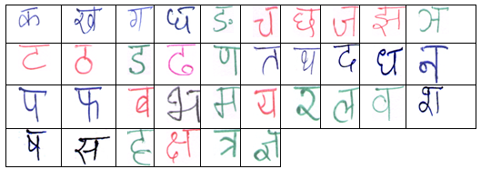
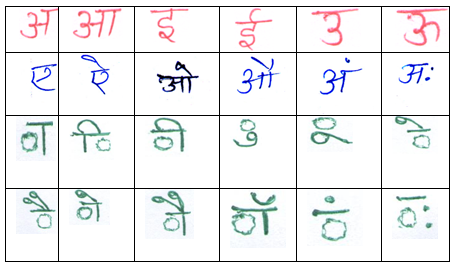
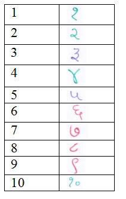

#  $CALAM_{NN}$- HANDWRITTEN DEVANAGARI  CHARACTERS (with MODIFIERS} DATABASE
**DOI:** https://doi.org/10.1007/978-81-322-2638-3 \
**Contributors:** Dr. Neeta Nain, Rahul Paliwal \
**Institute:** Malaviya National Institute of Technology Jaipur \
**Article:** Handwritten Devnagari Script Database Development for Off-Line Hindi Character with Matra (Modifiers) \
**Conference:** Proceedings of the International Conference on Recent Cognizance in Wireless Communication & Image Processing, pp. 233-240, Springer 2016 \
**Published:** 2016

# $CALAM_{NN}$- HANDWRITTEN DEVANAGARI  CHARACTERS (with MODIFIERS} DATABASE
 <div>Handwritten Vowels and Consonants (with Modifiers) Devanagari database developed at the Department of Computer
    Science and Engineering of the Malaviya National Institute of Technology as part of research project grant
    (P.7.S.T/RD/2013/4400 – Urdu Corpus Development and HTR sanctioned by DST, Government of Rajasthan. A database for
    off-line Hindi handwritten character with matras (modifiers) is developed. Data set is collected from persons of
    different age, gender, profession and educational qualification. The character images are stored as images in PNG
    image format for efficient use.
    The dataset consists of more than 23000 images of their original size with programmatically segmented consonant,
    Numerals and Vowels. Data are also collected from person from different geographical locations of India.<br />
  </div>
  <div class="heading">
    <h3> <b>Highlights</b></h3>
    <hr />
  </div>
  <div>
    <ul>
      <li>Hindi hand written Vowels and Consonants with matras (modifiers) written by around 1200 writers from
        geographically diverse places.</li>
      <li>More than 23000 handwritten (alphabets) characters images of consonants, Numerals and Vowels Characters
        scanned at 300 dpi.</li>
      <li>Devanagari handwritten and Unicode corpus containing 1600 handwritten text-pages, written by 1600 different
        writers containing 8,800 Hindi handwritten text lines,
        with 1,20,000 Hindi handwritten text words. Each form contains approximately 4.53 text lines and 68.91 text
        words.
        In addition to this the database contains 4,160 Hindi printed text lines.</li>
      <li> XML file format (structural and Unicode Ground truths) in a hierarchical manner having complete information
        for research findings.</li>
    </ul>
    <br />
   
 <table border="0" cellpadding="10" align="center"> <tr> <th>Sample Consonants:</th> <th>Sample Vowels:</th> <th>Sample Numerals:</th> </tr> <tr> <td></td> <td></td> <td></td> </tr> </table>
  </div>

Download :<a href="https://drive.google.com/file/d/1ZJb4utE9Xyi-Kvt75_NeNPBBVXk5Djzv/view?usp=sharing"> Hindi Consonents</a>   <br />
Download :<a href="https://drive.google.com/file/d/1ViGofs9ymEq7Vw3ANBSKg1u0gRuB40gl/view?usp=sharing"> Hindi Numerals </a>  <br />
Download :<a href="https://drive.google.com/file/d/1HZR3Cjgs-jDe6MNswLJ6oMyZoA0HgwIK/view?usp=sharing" > Hindi Vovewls</a> <br />
Download :<a href="Handwritten_Devnagari_Script_Database_Development.pdf" > Handwritten Devnagari Script Database Development for Off-Line Hindi
Character with Matra (Modifiers)</a>
 <br />
 To Access CALAM<sub>NN</sub>-Dataset: Please send the filled and signed in <a
        href="consent form.pdf">Agreement form </a> </b>
    <h3> <b>Contact</b></h3>
  ## Cite
```
@article{kushwaha2021texture,
  title={Handwritten Devnagari Script Database Development for Off-Line Hindi Character with Matra (Modifiers)},
  author={Maninder Singh Nehra, Neeta Nain and Mushtaq Ahmed},
  proceedings={International Conference on Recent Cognizance in Wireless Communication & Image Processing, pp. 233-240, Springer 2016},
  pages={233--240},
  year={2016},
  publisher={Springer}
}

```

## Published Articles/ References:  
   1. Prakash Choudhary and Neeta Nain ,"CALAM: Linguistic Structure to Annotate Handwritten Text Image Corpus" Computational Intelligence in Data Mining by Springer at Orissa / 449-460 / 2014

   2. Prakash Choudhary, Neeta Nain ,"CALAM: Model-Based Compilation and Linguistic Statistical Analysis of Urdu Corpus" , Sadhana Volume :45 / 20 / 2020 ISBN: 0256-2499

   3. Deepti Khanduja, Neeta Nain, Subhash Panwar, ACM Transactions on Asian and Low-Resource Language Information Processing (TALLIP), Volume 15 Issue 1, Article No. 2, pp. 1- 10, November 2015.

   4. Prakash Choudhary, Neeta Nain, A Four-Tier Annotated Urdu Handwritten Text Image Dataset for Multidisciplinary Research on Urdu Script, ACM Transactions on Asian and Low-Resource Language Information Processing (TALLIP), Volume 15 Issue 4, Article No. 26, pp. 1-23, June 2016.

5. Deepa Modi, Neeta Nain, Maninder Nehra, Part-of-speech Tagging for Hindi Corpus in Poor Resource Scenario, Journal of Multimedia Information Systems Volume 5(3):, pp.147-154

6. Maninder Singh Nehra, Neeta Nain and Mushtaq Ahmed, "Handwritten Devnagari Script Database Development for Off-Line Hindi Character with Matra (Modifiers)”, Proceedings of the International Conference on Recent Cognizance in Wireless Communication & Image Processing, pp. 233-240, Springer 2016


    <hr />
    <b>Contact:</b> nnain.cse@mnit.ac.in
  </div>
  <div>
